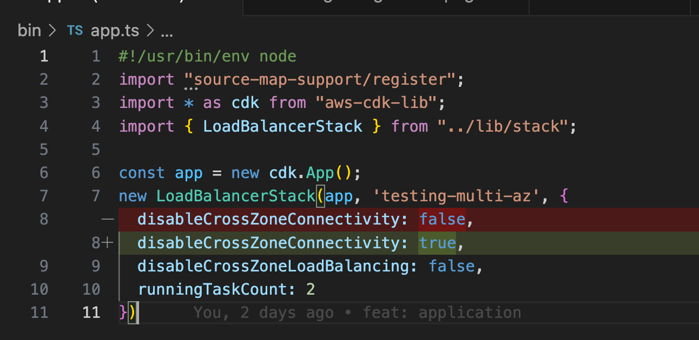
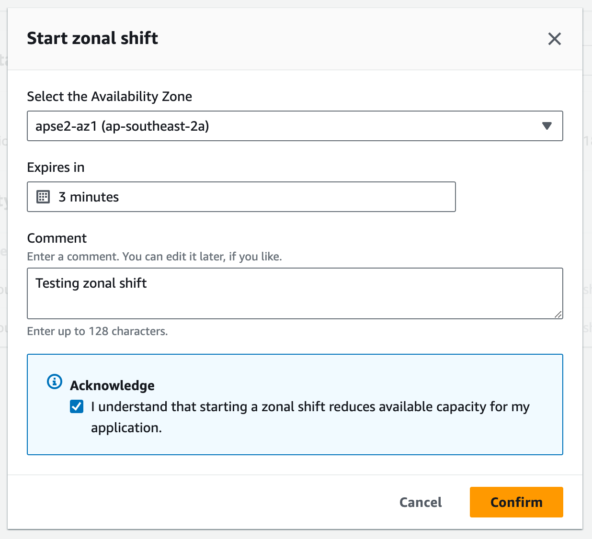
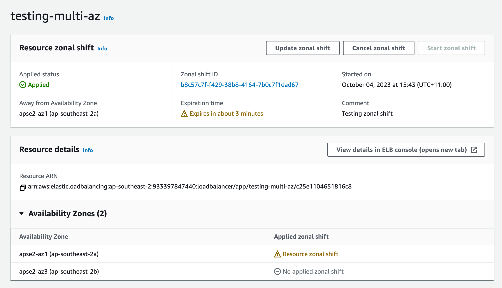

# Exploring behaviours of AWS Application Load Balancers configured for Multi-AZ

This CDK project provides a hands-on testbed for exploring how multi-AZ load balancing on AWS handles interruptions, focusing on the role of cross-zone load balancing.

**Please note that the resources deployed in this example application have hourly costs! Ensure you clean up after yourself.**

## Getting Started

Install dependencies

```sh
pnpm install
```

Deploy demo stack using CDK

```sh
pnpm cdk deploy
```

## About the demo stack

This repo deploys a CloudFormation stack called `testing-multi-az` that configures the following test architecture:


A simple VPC with two public subnets across two Availability Zones (AZs) is deployed. Into this VPC a load balanced Fargate service is deployed, configured across the two subnets. The Fargate service is a simple API with a single health endpoint:

```
GET /
200
{ "message": "ok" }
```

## Exploring how the load balancer manages endpoints

Find the load balancer hostname through the AWS Console


Resolving this DNS will show that the load balancer publishes multiple addresses to receive requests on:

```
$ nslookup testing-multi-az-1303684287.ap-southeast-2.elb.amazonaws.com
Server:		192.168.1.1
Address:	192.168.1.1#53

Non-authoritative answer:
Name:	testing-multi-az-1303684287.ap-southeast-2.elb.amazonaws.com
Address: 13.237.107.118
Name:	testing-multi-az-1303684287.ap-southeast-2.elb.amazonaws.com
Address: 54.252.221.97

$ curl 13.237.107.118
{"message":"ok"}

$ curl 54.252.221.97
{"message":"ok"}
```

In the AWS Console > EC2 > Network Interfaces, we can see the allocated network interfaces. We can see the load balancer deploys a network interface in the configured subnet for each AZ:


## Running the client script to test load balancer endpoints

The client script repeatedly resolves a given hostname and issues requests against each resolved IP address. Stats of responses from each IP address are printed.

Run the client script to see how the load balancer handles requests across both AZs -- the basis for high availability.

```
$ pnpm client testing-multi-az-1303684287.ap-southeast-2.elb.amazonaws.com

> aws-ecs-deployment-analysis@0.1.0 client /Users/tom.wright/Projects/aws-multi-az-load-balancers
> ts-node bin/client.ts "testing-multi-az-1303684287.ap-southeast-2.elb.amazonaws.com"

23:52:39 13.237.107.118  -> 200 OK            13.237.107.118|200=1
23:52:39 54.252.221.97   -> 200 OK            13.237.107.118|200=1 54.252.221.97|200=1
23:52:40 13.237.107.118  -> 200 OK            13.237.107.118|200=2 54.252.221.97|200=1
23:52:40 54.252.221.97   -> 200 OK            13.237.107.118|200=2 54.252.221.97|200=2
23:52:41 13.237.107.118  -> 200 OK            13.237.107.118|200=3 54.252.221.97|200=2
23:52:41 54.252.221.97   -> 200 OK            13.237.107.118|200=3 54.252.221.97|200=3
23:52:43 54.252.221.97   -> 200 OK            13.237.107.118|200=3 54.252.221.97|200=4
23:52:43 13.237.107.118  -> 200 OK            13.237.107.118|200=4 54.252.221.97|200=4
23:52:44 13.237.107.118  -> 200 OK            13.237.107.118|200=5 54.252.221.97|200=4
23:52:44 54.252.221.97   -> 200 OK            13.237.107.118|200=5 54.252.221.97|200=5
23:52:45 54.252.221.97   -> 200 OK            13.237.107.118|200=5 54.252.221.97|200=6
23:52:45 13.237.107.118  -> 200 OK            13.237.107.118|200=6 54.252.221.97|200=6
23:52:46 13.237.107.118  -> 200 OK            13.237.107.118|200=7 54.252.221.97|200=6
23:52:46 54.252.221.97   -> 200 OK            13.237.107.118|200=7 54.252.221.97|200=7
23:52:47 54.252.221.97   -> 200 OK            13.237.107.118|200=7 54.252.221.97|200=8
23:52:47 13.237.107.118  -> 200 OK            13.237.107.118|200=8 54.252.221.97|200=8
...
```

## Exploring cross-zone load balancing

Currently our load balancer _(*)_ is configured for "cross-zone" load balancing which configures each endpoint to consider all targets valid, not just the ones within the same Availability Zone (AZ).

> _*: In reality, the cross-zone load balancing is an attribute of the target group behind the load balancer. But whatever._

We can see this reflected in the "healthy host count" metric in CloudWatch. Each endpoint has access to two healthy and routable hosts to fulfil requests.


Importantly, if we look at the "sample count" for these metrics, we can see that each endpoint is posting its own "view" of the healthy routable hosts -- two samples for two endpoints.


We can see the improved reliability of cross-zone load balancing in action by scaling down our Fargate service to run a single task. Update your `app.ts` and redeploy with `pnpm cdk deploy`:


Following deployment, we have the following architecture where one load balancer endpoint is relying on cross-zone load balancing:


The metrics reflect that there is only a single routable task:


Both load balancer endpoints continue to serve correctly, maintaining high availability at the load balancer layer:

```
$ pnpm client testing-multi-az-1303684287.ap-southeast-2.elb.amazonaws.com

> aws-ecs-deployment-analysis@0.1.0 client /Users/tom.wright/Projects/aws-multi-az-load-balancers
> ts-node bin/client.ts "testing-multi-az-1303684287.ap-southeast-2.elb.amazonaws.com"

00:20:03 54.252.221.97   -> 200 OK            54.252.221.97|200=1
00:20:03 13.237.107.118  -> 200 OK            13.237.107.118|200=1 54.252.221.97|200=1
00:20:04 13.237.107.118  -> 200 OK            13.237.107.118|200=2 54.252.221.97|200=1
00:20:04 54.252.221.97   -> 200 OK            13.237.107.118|200=2 54.252.221.97|200=2
00:20:05 54.252.221.97   -> 200 OK            13.237.107.118|200=2 54.252.221.97|200=3
00:20:05 13.237.107.118  -> 200 OK            13.237.107.118|200=3 54.252.221.97|200=3
00:20:06 13.237.107.118  -> 200 OK            13.237.107.118|200=4 54.252.221.97|200=3
00:20:06 54.252.221.97   -> 200 OK            13.237.107.118|200=4 54.252.221.97|200=4
00:20:07 54.252.221.97   -> 200 OK            13.237.107.118|200=4 54.252.221.97|200=5
00:20:07 13.237.107.118  -> 200 OK            13.237.107.118|200=5 54.252.221.97|200=5
00:20:09 13.237.107.118  -> 200 OK            13.237.107.118|200=6 54.252.221.97|200=5
00:20:09 54.252.221.97   -> 200 OK            13.237.107.118|200=6 54.252.221.97|200=6
00:20:10 13.237.107.118  -> 200 OK            13.237.107.118|200=7 54.252.221.97|200=6
00:20:10 54.252.221.97   -> 200 OK            13.237.107.118|200=7 54.252.221.97|200=7
...
```

Let's now disable cross-zone load balancing and see how the load balancer behaves. Update your `app.ts` and redeploy with `pnpm cdk deploy`:


As the change deploys, get your client script running so you can observe the behaviour of the load balancer as cross-zone load balancing is disabled:

```
pnpm client testing-multi-az-1303684287.ap-southeast-2.elb.amazonaws.com

> aws-ecs-deployment-analysis@0.1.0 client /Users/tom.wright/Projects/aws-multi-az-load-balancers
> ts-node bin/client.ts "testing-multi-az-1303684287.ap-southeast-2.elb.amazonaws.com"

00:23:59 13.237.107.118  -> 200 OK            13.237.107.118|200=1
00:23:59 54.252.221.97   -> 200 OK            13.237.107.118|200=1 54.252.221.97|200=1
00:24:00 13.237.107.118  -> 200 OK            13.237.107.118|200=2 54.252.221.97|200=1
00:24:00 54.252.221.97   -> 200 OK            13.237.107.118|200=2 54.252.221.97|200=2
...
00:24:07 54.252.221.97   -> 200 OK            13.237.107.118|200=8 54.252.221.97|200=9
00:24:07 13.237.107.118  -> 200 OK            13.237.107.118|200=9 54.252.221.97|200=9
00:24:08 13.237.107.118  -> 200 OK            13.237.107.118|200=10 54.252.221.97|200=9
00:24:08 54.252.221.97   -> 200 OK            13.237.107.118|200=10 54.252.221.97|200=10
00:24:09 54.252.221.97   -> 200 OK            13.237.107.118|200=10 54.252.221.97|200=11
00:24:09 13.237.107.118  -> 200 OK            13.237.107.118|200=11 54.252.221.97|200=11
00:24:10 54.252.221.97   -> 200 OK            13.237.107.118|200=11 54.252.221.97|200=12
00:24:10 13.237.107.118  -> 200 OK            13.237.107.118|200=12 54.252.221.97|200=12

[1]

00:24:11 13.237.107.118  -> 503 Service Temporarily Unavailable 13.237.107.118|200=12 13.237.107.118|503=1 54.252.221.97|200=12
00:24:11 54.252.221.97   -> 200 OK            13.237.107.118|200=12 13.237.107.118|503=1 54.252.221.97|200=13
00:24:12 13.237.107.118  -> 503 Service Temporarily Unavailable 13.237.107.118|200=12 13.237.107.118|503=2 54.252.221.97|200=13
00:24:12 54.252.221.97   -> 200 OK            13.237.107.118|200=12 13.237.107.118|503=2 54.252.221.97|200=14
00:24:14 54.252.221.97   -> 200 OK            13.237.107.118|200=12 13.237.107.118|503=2 54.252.221.97|200=15
00:24:14 13.237.107.118  -> 503 Service Temporarily Unavailable 13.237.107.118|200=12 13.237.107.118|503=3 54.252.221.97|200=15
00:24:15 13.237.107.118  -> 503 Service Temporarily Unavailable 13.237.107.118|200=12 13.237.107.118|503=4 54.252.221.97|200=15
00:24:15 54.252.221.97   -> 200 OK            13.237.107.118|200=12 13.237.107.118|503=4 54.252.221.97|200=16
...
00:25:10 13.237.107.118  -> 503 Service Temporarily Unavailable 13.237.107.118|200=12 13.237.107.118|503=56 54.252.221.97|200=67
00:25:10 54.252.221.97   -> 200 OK            13.237.107.118|200=12 13.237.107.118|503=56 54.252.221.97|200=68
00:25:11 13.237.107.118  -> 503 Service Temporarily Unavailable 13.237.107.118|200=12 13.237.107.118|503=57 54.252.221.97|200=68
00:25:11 54.252.221.97   -> 200 OK            13.237.107.118|200=12 13.237.107.118|503=57 54.252.221.97|200=69
00:25:12 13.237.107.118  -> 503 Service Temporarily Unavailable 13.237.107.118|200=12 13.237.107.118|503=58 54.252.221.97|200=69

[2]

00:25:12 54.252.221.97   -> 200 OK            13.237.107.118|200=12 13.237.107.118|503=58 54.252.221.97|200=70
00:25:13 54.252.221.97   -> 200 OK            13.237.107.118|200=12 13.237.107.118|503=58 54.252.221.97|200=71
00:25:14 54.252.221.97   -> 200 OK            13.237.107.118|200=12 13.237.107.118|503=58 54.252.221.97|200=72
00:25:15 54.252.221.97   -> 200 OK            13.237.107.118|200=12 13.237.107.118|503=58 54.252.221.97|200=73
00:25:16 54.252.221.97   -> 200 OK            13.237.107.118|200=12 13.237.107.118|503=58 54.252.221.97|200=74
00:25:17 54.252.221.97   -> 200 OK            13.237.107.118|200=12 13.237.107.118|503=58 54.252.221.97|200=75
00:25:19 54.252.221.97   -> 200 OK            13.237.107.118|200=12 13.237.107.118|503=58 54.252.221.97|200=76
00:25:20 54.252.221.97   -> 200 OK            13.237.107.118|200=12 13.237.107.118|503=58 54.252.221.97|200=77
00:25:21 54.252.221.97   -> 200 OK            13.237.107.118|200=12 13.237.107.118|503=58 54.252.221.97|200=78
00:25:22 54.252.221.97   -> 200 OK            13.237.107.118|200=12 13.237.107.118|503=58 54.252.221.97|200=79
00:25:23 54.252.221.97   -> 200 OK            13.237.107.118|200=12 13.237.107.118|503=58 54.252.221.97|200=80
00:25:24 54.252.221.97   -> 200 OK            13.237.107.118|200=12 13.237.107.118|503=58 54.252.221.97|200=81
00:25:25 54.252.221.97   -> 200 OK            13.237.107.118|200=12 13.237.107.118|503=58 54.252.221.97|200=82
```

As cross-zone load balancing is disabled, we see:

1. One of the load balancer endpoints resorts to serving `503 Service Temporarily Unavailable` in respond to no longer having any routable hosts.
2. After 60 seconds, we see the `13.237.107.118` endpoint that was serving `503` stops receiving requests from our client. The DNS hostname for the load balancer has been updated to no longer resolve that endpoint to remove it from service. This is known as "DNS failover".

The 60 second delay is attributable to a 60 second TTL on the DNS records that AWS maintains for load balancers. This TTL is described in this AWS documentation under the [Request routing](https://docs.aws.amazon.com/elasticloadbalancing/latest/userguide/how-elastic-load-balancing-works.html#request-routing) section.

This behaviour is described in general terms in this AWS documentation on [Cross-zone load balancing for target groups](https://docs.aws.amazon.com/elasticloadbalancing/latest/network/target-group-cross-zone.html).

Our CloudWatch Metric "sample counts" also reflect that the load balancer endpoint has been removed from service, showing a sample count of 1:


### Simulating AZ connectivity issues

To begin with lets restore cross-zone load balancing and our task count. Update `app.ts` and redeploy:


Next we will simulate a network connectivity issue between the AZs we are present in (implemented by Network ACLs). Update `app.ts` and redeploy:



This results in the following architecture. Attempts to perform cross-zone load balancing fail due to a lack of network connectivity:


As cross-AZ connectivity is interrupted, we see this reflected in some confusing host health metrics published by the load balancer endpoints:


Both hosts are actually healthy, but only for requests originating from the same-AZ load balancer endpoint. Each endpoint is publishing metrics as:
- 1 healthy host (the same-AZ one)
- 1 unhealthy host (the cross-AZ one)

As each endpoint still has healthy hosts, each AZ continues to serve correctly despite the interruption:

```
$ pnpm client testing-multi-az-1303684287.ap-southeast-2.elb.amazonaws.com

> aws-ecs-deployment-analysis@0.1.0 client /Users/tom.wright/Projects/aws-multi-az-load-balancers
> ts-node bin/client.ts "testing-multi-az-1303684287.ap-southeast-2.elb.amazonaws.com"

00:58:47 54.252.221.97   -> 200 OK            54.252.221.97|200=1
00:58:47 13.237.107.118  -> 200 OK            13.237.107.118|200=1 54.252.221.97|200=1
00:58:48 54.252.221.97   -> 200 OK            13.237.107.118|200=1 54.252.221.97|200=2
00:58:48 13.237.107.118  -> 200 OK            13.237.107.118|200=2 54.252.221.97|200=2
00:58:49 13.237.107.118  -> 200 OK            13.237.107.118|200=3 54.252.221.97|200=2
00:58:49 54.252.221.97   -> 200 OK            13.237.107.118|200=3 54.252.221.97|200=3
00:58:50 13.237.107.118  -> 200 OK            13.237.107.118|200=4 54.252.221.97|200=3
00:58:50 54.252.221.97   -> 200 OK            13.237.107.118|200=4 54.252.221.97|200=4
00:58:51 54.252.221.97   -> 200 OK            13.237.107.118|200=4 54.252.221.97|200=5
00:58:51 13.237.107.118  -> 200 OK            13.237.107.118|200=5 54.252.221.97|200=5
00:58:52 13.237.107.118  -> 200 OK            13.237.107.118|200=6 54.252.221.97|200=5
00:58:52 54.252.221.97   -> 200 OK            13.237.107.118|200=6 54.252.221.97|200=6
00:58:53 13.237.107.118  -> 200 OK            13.237.107.118|200=7 54.252.221.97|200=6
00:58:53 54.252.221.97   -> 200 OK            13.237.107.118|200=7 54.252.221.97|200=7
```

But our architecture is now more vulnerable: let's simulate an interruption to the running service in one zone by reducing the running task count to 1 again. Update `app.ts` and redeploy:


As the change deploys, get your client script running so you can observe the behaviour of the load balancer in response to the interruption:

```
pnpm client testing-multi-az-1303684287.ap-southeast-2.elb.amazonaws.com

> aws-ecs-deployment-analysis@0.1.0 client /Users/tom.wright/Projects/aws-multi-az-load-balancers
> ts-node bin/client.ts "testing-multi-az-1303684287.ap-southeast-2.elb.amazonaws.com"

01:02:11 54.252.221.97   -> 200 OK            54.252.221.97|200=1
01:02:11 13.237.107.118  -> 200 OK            13.237.107.118|200=1 54.252.221.97|200=1
01:02:12 13.237.107.118  -> 200 OK            13.237.107.118|200=2 54.252.221.97|200=1
01:02:12 54.252.221.97   -> 200 OK            13.237.107.118|200=2 54.252.221.97|200=2
01:02:13 13.237.107.118  -> 200 OK            13.237.107.118|200=3 54.252.221.97|200=2
...
01:02:55 54.252.221.97   -> 200 OK            13.237.107.118|200=41 54.252.221.97|200=41
01:02:56 13.237.107.118  -> 200 OK            13.237.107.118|200=42 54.252.221.97|200=41
01:02:56 54.252.221.97   -> 200 OK            13.237.107.118|200=42 54.252.221.97|200=42
01:02:57 13.237.107.118  -> 200 OK            13.237.107.118|200=43 54.252.221.97|200=42
01:02:57 54.252.221.97   -> 200 OK            13.237.107.118|200=43 54.252.221.97|200=43
01:02:58 54.252.221.97   -> 200 OK            13.237.107.118|200=43 54.252.221.97|200=44
01:03:08 13.237.107.118  -> 504 Gateway Time-out 13.237.107.118|200=43 13.237.107.118|504=1 54.252.221.97|200=44
01:03:09 54.252.221.97   -> 200 OK            13.237.107.118|200=43 13.237.107.118|504=1 54.252.221.97|200=45
01:03:19 13.237.107.118  -> 504 Gateway Time-out 13.237.107.118|200=43 13.237.107.118|504=2 54.252.221.97|200=45
01:03:20 54.252.221.97   -> 200 OK            13.237.107.118|200=43 13.237.107.118|504=2 54.252.221.97|200=46
01:03:30 13.237.107.118  -> 504 Gateway Time-out 13.237.107.118|200=43 13.237.107.118|504=3 54.252.221.97|200=46
01:03:31 54.252.221.97   -> 200 OK            13.237.107.118|200=43 13.237.107.118|504=3 54.252.221.97|200=47
01:03:32 54.252.221.97   -> 200 OK            13.237.107.118|200=43 13.237.107.118|504=3 54.252.221.97|200=48
01:03:33 54.252.221.97   -> 200 OK            13.237.107.118|200=43 13.237.107.118|504=3 54.252.221.97|200=49
01:03:34 54.252.221.97   -> 200 OK            13.237.107.118|200=43 13.237.107.118|504=3 54.252.221.97|200=50
01:03:36 54.252.221.97   -> 200 OK            13.237.107.118|200=43 13.237.107.118|504=3 54.252.221.97|200=51
01:03:37 54.252.221.97   -> 200 OK            13.237.107.118|200=43 13.237.107.118|504=3 54.252.221.97|200=52
01:03:38 54.252.221.97   -> 200 OK            13.237.107.118|200=43 13.237.107.118|504=3 54.252.221.97|200=53
01:03:39 54.252.221.97   -> 200 OK            13.237.107.118|200=43 13.237.107.118|504=3 54.252.221.97|200=54
01:03:40 54.252.221.97   -> 200 OK            13.237.107.118|200=43 13.237.107.118|504=3 54.252.221.97|200=55
01:03:41 54.252.221.97   -> 200 OK            13.237.107.118|200=43 13.237.107.118|504=3 54.252.221.97|200=56
...
```

Similar to our previous example, as one of the endpoints loses access to its only healthy host, we see:

1. One of the load balancer endpoints begins serving `504 Gateway Time-out`. This is the endpoint that is attempting to perform cross-zone load balancing while cross-AZ connectivity is interrupted, resulting in request timeout. The cross-AZ host starts failing health checks and despite now only having unhealthy hosts the endpoint attempts to forward requests regardless. This is known as "fail open".
2. After 60 seconds, we see the `13.237.107.118` endpoint that was serving `504` stops receiving requests from our client. The DNS hostname for the load balancer has been updated to no longer resolve that endpoint to remove it from service. This is known as "DNS failover".


These behaviours are described in this AWS documentation on [Target group health](https://docs.aws.amazon.com/elasticloadbalancing/latest/network/target-group-health.html), under the section Unhealthy state actions.

### Forcing DNS failover using Route 53 ARC Zonal Shift

Route 53 ARC (Application Recovery Controller) has a feature, [Zonal Shift](https://docs.aws.amazon.com/elasticloadbalancing/latest/application/zonal-shift.html), that allows you to manually force DNS failover to direct traffic away from a problematic Availability Zone (AZ).

As we have seen in our examples above, generally the load balancer will perform its own DNS failover in response to unhealthy conditions. But depending on the nature of the fault that is been introduced into the system having a manual override may be necessary if the load balancer isn't failing over itself.

Importantly, **cross-zone load balancing must be disabled to use Zonal Shift**. Update `app.ts` and redeploy:


Find Zonal Shift under the Route 53 Application Recovery Controller service in the AWS Console:


Once cross-zone load balancing is disabled, our load balancer is available in the list of resources for Zonal Shift.


Select the resource and create a Zonal Shift, specifying the Availability Zone (AZ) to shift **away from** and how long to shift for.



Once the Zonal Shift is in effect, observe the shift by resolving the DNS hostname of the load balancer to see that the endpoint in the specified Availability Zone is no longer being broadcast:



```
$ nslookup testing-multi-az-1303684287.ap-southeast-2.elb.amazonaws.com
Server:		192.168.1.1
Address:	192.168.1.1#53

Non-authoritative answer:
Name:	testing-multi-az-1303684287.ap-southeast-2.elb.amazonaws.com
Address: 54.252.221.97

$ curl 54.252.221.97
{"message":"ok"}
```

## Clean Up

Remember that **the resources deployed in this example application have hourly costs!**

```sh
$ pnpm cdk destroy

> aws-ecs-deployment-analysis@0.1.0 cdk /Users/tom.wright/Projects/aws-multi-az-load-balancers
> cdk "destroy"

Are you sure you want to delete: testing-multi-az (y/n)? y
testing-multi-az: destroying... [1/1]

 ✅  testing-multi-az: destroyed
```